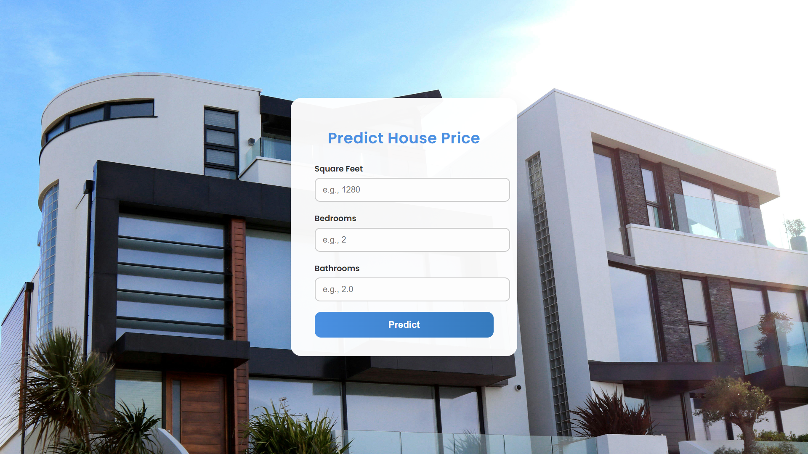

# House Price Prediction using Linear Regression



This project implements a **Linear Regression** model to predict house prices using key property features:

- **Square Footage**
- **Number of Bedrooms**
- **Number of Bathrooms**

The web application is developed with **Django** for the frontend and **scikit-learn** for the machine learning model.

---

## 📁 Project Structure

project-root/
│
├── App/                      # Django app for the web interface
│   ├── migrations/           # Django migration files
│   ├── templates/            # HTML templates
│   ├── static/               # CSS, JS, image assets
│   └── views.py              # Django views (sample)
│
├── dataset/                  # Dataset folder
│   ├── train.csv             # Training data
│   └── test.csv              # Testing data
│
├── module/                   # Python module for model logic and execution
│   ├── houseprice.py         # Contains a class with methods to train, save, and predict
│   ├── main.py               # Script that uses the class in houseprice.py to perform operations
│   └── model.pkl             # Trained machine learning model (output after training)
│
├── image.jpg                 # Screenshot of the web interface
├── manage.py                 # Django management script
└── README.md                 # Project documentation

---

## 🚀 Features

- Trains a **linear regression** model to predict housing prices.
- Takes user inputs: square footage, number of bedrooms, and bathrooms.
- Predicts the house price based on the trained model.
- Offers a user-friendly **Django web interface**.
- Clean input handling and prediction output.

---

## 🛠 Requirements

**Python Version:** 3.8+

**Install Required Packages:**
```bash
pip install -r requirements.txt
```

**Included Libraries:**

* Django >= 3.2
* pandas
* scikit-learn

---

## ⚙️ How to Run

### 1. Train the Model

Navigate to the `module/` directory and run the training script:

```bash
cd module
python main.py
```

This script will:

* Load the training dataset from `dataset/train.csv`
* Instantiate and use a class from `houseprice.py`
* Train a linear regression model
* Save the trained model as `model.pkl`

---

### 2. Start the Django Web App

From the project root directory:

```bash
python manage.py runserver
```

Once running, open your browser and go to:

```
http://127.0.0.1:8000/
```

Use the web form to input property details and view predicted house prices.

---

## 🖼 Interface Preview


---

## 📌 Notes

* Ensure the dataset files (`train.csv`, `test.csv`) are correctly formatted and placed in the `dataset/` directory.
* You can expand `houseprice.py` to include more advanced features such as:

  * Location encoding
  * Property age
  * Number of floors or garages
* Useful for learning and demonstrating linear regression with a live interface.

---

## 📧 Contact

For bugs, feedback, or contributions, feel free to:

* Open an issue on the GitHub repository
* Reach out to the project maintainer via the repository page

---
